# A Step by Step Tutorial to Deployment Example

Tekton deployments from GitHub

## Requirements

* Tekton Pipeline v0.10.1
* Tekton Triggers v0.2.1
* Set the following environment varialbes
    * USER=\<OS user \>  (It should be automatically set by OS.)
    * QUAY_USER=\<Ouay.io user\>
    * GITHUB_USER=\<GitHub user\>
    * DEPLOYMENT_PATH=deploy


## Create Demo Git Repositories

Login to Your GitHub account.  Create your demo Git repositories `taxi` and `taxi-stage-config`.  Then, follow the instructions in Github to import from the following repos, respectively.   
   * https://github.com/bigkevmcd/taxi
   * https://github.com/bigkevmcd/taxi-stage-config

These are your test repositories where you will submit Pull Requests, merge them to master in order to trigger Pipeline Runs.

 ## Download your Gihub Access Token

 The [`create-github-status-task`](#create-github-status-task) needs Github user's access token to update Github repo status.   You will create a Kubernetes secret from the downloaded access token later in the Tutorial.
 
 Go to https://github.com/settings/tokens and generate an access token.   Download and save it to `github-token.txt`.

 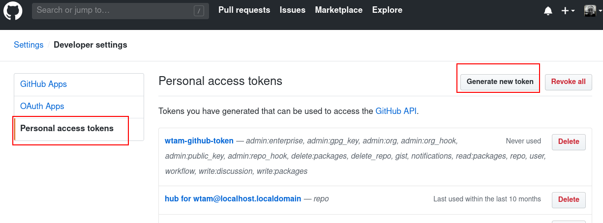

## Create Projects/Namespaces

Create the following projects.

```shell
oc new-project ${USER}-dev-environment
oc new-project ${USER}-stage-environment
oc new-project ${USER}-cicd-environment
```

**_NOTE:_**  Continue this setup in `${USER}-cicd-environment` project.


## Quay Credentials to push built image to Quay.io registry

 Some of the Tasks in this Tutorial involve pushing images to Quay image registry.   (The image is to be built by CI Pipeline.)   Before we can start creating Kubernetes resources, we need to obtain credentials for your Quay user account.

 * Create `taxi` Quay repos.   Login to your Quay.io account and create a repository `taxi`

  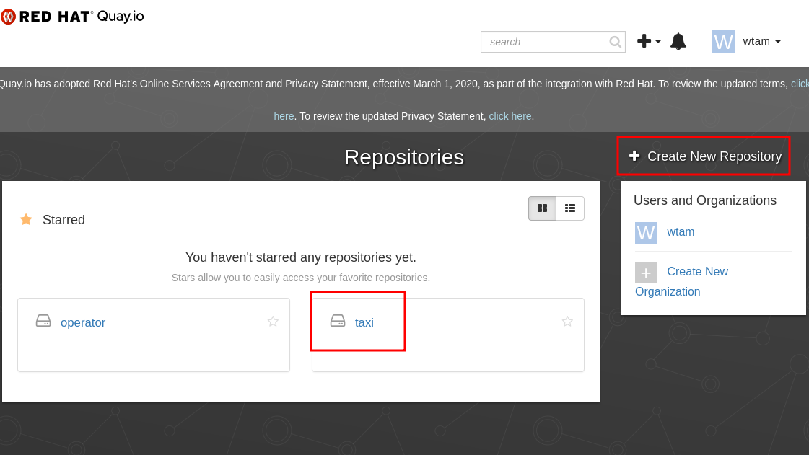

 * Login to your Quay.io account that you can generate read/write credentials for.  In user's name pulldown menu, goto Account Settings -> Robot Account (button on the left).   Create a robot account for yourself.  Click your robot account link.

 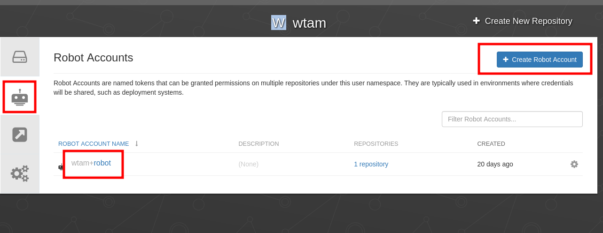

 * Select `Edit Repository Permissions` menu item

  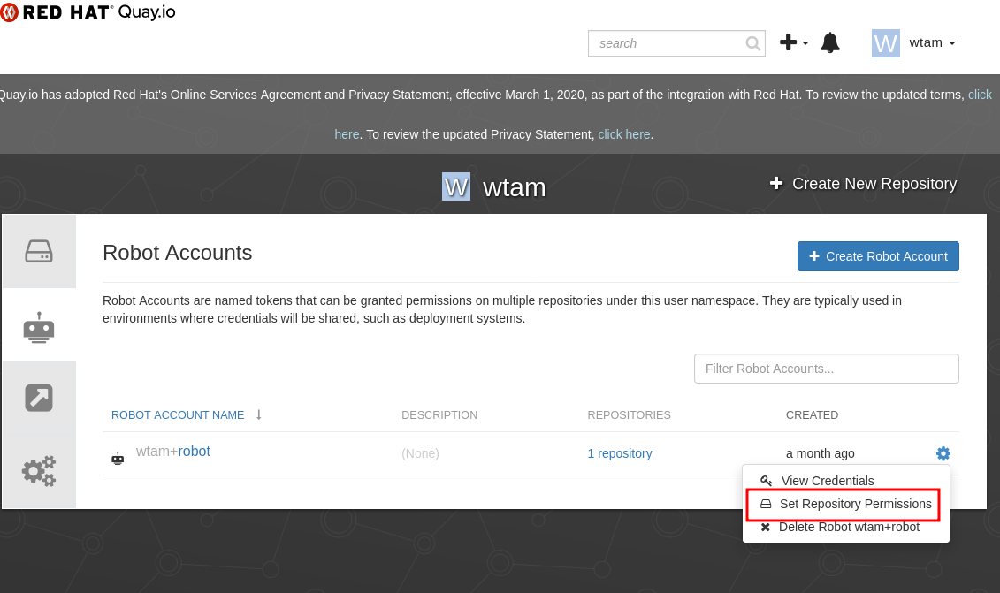

* Grant `write` permission to repository `taxi`

 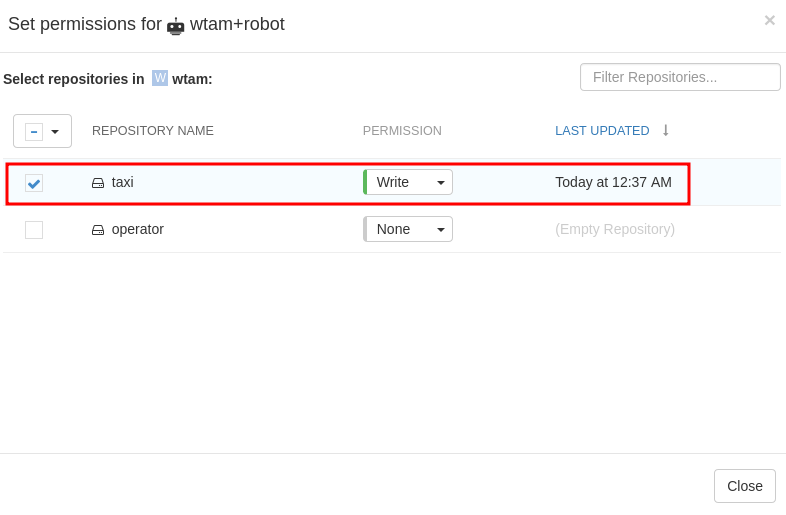

* Download Docker Configuration file to `<Quay user>-robot-auth.json`

   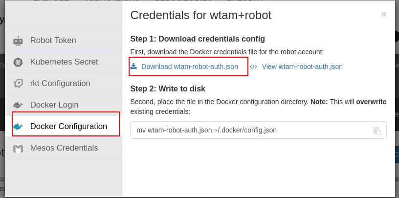

* Create `regcred` secret from Docker Configuration file

**_NOTE:_**  Make sure `QUAY_USER` envrionment variable is set.
**_NOTE:_**  Modify path to downloaded file accordingly.

```shell
oc create secret generic regcred --from-file=.dockerconfigjson="$HOME/Downloads/${QUAY_USER}-robot-auth.json" --type=kubernetes.io/dockerconfigjson
```

 You can check the created secrets. 
 
 ```shell
 oc get secret
 ```

 ## Setup Service Account

* Create Service Account (**replace \<user\> with your userid**)

Service Account `demo-sa` is the cluster credentials that Pipeline Runs will be executed on.  Looking at the yaml snippet below, `demo-sa` has the regcred secret which we downloaded from Quay user account. 

**_NOTE:_**  Make sure `QUAY_USER` envrionment variable is set.


```shell
cat <<EOF | oc apply -f -
apiVersion: v1
kind: ServiceAccount
metadata:
  name: demo-sa
secrets:
- name: regcred
EOF
```
* Create Role

Next, we need to give `demo-sa` some privileges to perform Pipeline Tasks.   The following snippet creates `Role` which contains privileges.  We will then create a `RoleBinding` to grant these privileges (Role) to `demo-sa`.

Save the following content to `temp.yaml`

 ```shell
kind: Role
apiVersion: rbac.authorization.k8s.io/v1
metadata:
  name: tekton-triggers-openshift-demo
rules:
- apiGroups: ["tekton.dev"]
   resources: ["eventlisteners", "triggerbindings", "triggertemplates", "tasks", "taskruns"]
   verbs: ["get"]
- apiGroups: ["tekton.dev"]
   resources: ["pipelineruns", "pipelineresources", "taskruns"]
   verbs: ["create"]
```
Apply `temp.yaml`
```shell
oc apply -f temp.yaml
```

 * Create Role Binding

 Save the following content to `temp.yaml`


 ```shell
apiVersion: rbac.authorization.k8s.io/v1
kind: RoleBinding
metadata:
   name: tekton-triggers-openshift-binding
subjects:
- kind: ServiceAccount
   name: demo-sa
roleRef:
   apiGroup: rbac.authorization.k8s.io
   kind: Role
   name: tekton-triggers-openshift-demo
 ```

Apply `temp.yaml`
```shell
oc apply -f temp.yaml
```
 * Configure Service Account admin policy 

We need to allow `demo-sa` to run as root in container.   This blog may help your understanding on Security Context Constraints. 
[Understanding Service Accounts and SCCs](https://blog.openshift.com/understanding-service-accounts-sccs/).  We also need to bind`Edit`Role to `demo-sa`.  The second command below is another way to perform RoleBinding.  See [Managing Role-based Access Control (RBAC)](https://docs.openshift.com/container-platform/3.11/admin_guide/manage_rbac.html)

Run the following commands setup additional security polcies for `demo-sa`.
 ```shell
oc adm policy add-scc-to-user privileged -z demo-sa
oc adm policy add-role-to-user edit -z demo-sa
```


* Create Role Bindings for Service Accounts in `dev` and `stage` projects

The following commands bind `admin` Cluster Role to `demo-sa` in dev-environment and stage-environment projects.


```shell
oc create rolebinding demo-sa-admin-dev --clusterrole=admin --serviceaccount=${USER}-cicd-environment:demo-sa --namespace=${USER}-dev-environment
oc create rolebinding demo-sa-admin-stage --clusterrole=admin --serviceaccount=${USER}-cicd-environment:demo-sa --namespace=${USER}-stage-environment
```
## Create Tasks

### buildah-task

The following is a replica of [buildah Task](https://github.com/tektoncd/catalog/tree/master/buildah).  You can read the documentation there for the usage of the Task.  In a nutshell, it has a `build` step and a `push` step.  It builds an image from source and push the built image to a registry.

Save the following content to `temp.yaml`

```shell
apiVersion: tekton.dev/v1alpha1
kind: Task
metadata:
  name: buildah-task
spec:
  inputs:
    params:
    - name: BUILDER_IMAGE
      description: The location of the buildah builder image.
      default: quay.io/buildah/stable:v1.11.3
      type: string
    - name: DOCKERFILE
      description: Path to the Dockerfile to build.
      default: ./Dockerfile
      type: string
    - name: TLSVERIFY
      description: Verify the TLS on the registry endpoint (for push/pull to a non-TLS registry)
      default: "true"
      type: string
    resources:
    - name: source
      type: git
  outputs:
    resources:
    - name: image
      type: image
  steps:
  - name: build
    image: $(inputs.params.BUILDER_IMAGE)
    workingDir: /workspace/source
    command: ['buildah', 'bud', '--tls-verify=$(inputs.params.TLSVERIFY)', '--layers', '-f', '$(inputs.params.DOCKERFILE)', '-t', '$(outputs.resources.image.url)', '.']
    volumeMounts:
    - name: varlibcontainers
      mountPath: /var/lib/containers
    securityContext:
      privileged: true
  - name: push
    image: $(inputs.params.BUILDER_IMAGE)
    workingDir: /workspace/source
    command: ['buildah', 'push', '--tls-verify=$(inputs.params.TLSVERIFY)', '$(outputs.resources.image.url)', 'docker://$(outputs.resources.image.url)']
    volumeMounts:
    - name: varlibcontainers
      mountPath: /var/lib/containers
    securityContext:
      privileged: true
  volumes:
  - name: varlibcontainers
    emptyDir: {}
```

Apply `temp.yaml`
```shell
oc apply -f temp.yaml
```

### create-github-status-task

This Task updates Github repo status.  It executes commands from an image (quay.io/kmcdermo/github-tool) from the source https://github.com/bigkevmcd/github-tool.

Save the following content to `temp.yaml`

```shell
apiVersion: tekton.dev/v1alpha1
kind: Task
metadata:
  name: create-github-status-task
spec:
  inputs:
    params:
    - name: REPO
      description: The repo to publish the status update for e.g. tektoncd/triggers
      type: string
    - name: COMMIT_SHA
      description: The specific commit to report a status for.
      type: string
    - name: STATE
      description: The state to report error, failure, pending, or success.
      type: string
    - name: TARGET_URL
      type: string
      default: ""
      description: The target URL to associate with this status.
    - name: DESCRIPTION
      type: string
      description: A short description of the status.
    - name: CONTEXT
      type: string
      description: A string label to differentiate this status from the status of other systems.
  steps:
  - name: start-status
    image: quay.io/kmcdermo/github-tool:latest
    workingDir: /workspace/source
    env:
    - name: GITHUB_TOKEN
      valueFrom:
        secretKeyRef:
          name: $GITHUB_USER-github-auth
          key: token
    command: ["github-tool"]
    args:
      - "create-status"
      - "--repo"
      - "$(inputs.params.REPO)"
      - "--sha"
      - "$(inputs.params.COMMIT_SHA)"
      - "--state"
      - "$(inputs.params.STATE)"
      - "--target-url"
      - "$(inputs.params.TARGET_URL)"
      - "--description"
      - "$(inputs.params.DESCRIPTION)"
      - "--context"
      - "$(inputs.params.CONTEXT)"
```      
Run the following command to apply `temp.yaml` with `sed` command to replace string value

**_NOTE:_**  Make sure `GIBHUB_USER` envrionment variable is set.

```shell
cat temp.yaml | sed s"/\$GITHUB_USER/$GITHUB_USER/" | oc apply -f -
```

### deploy-from-source-task

This command runs `kubectl -k` to deploy manifacts with [kuctomize](https://github.com/kubernetes-sigs/kustomize) option.  It executes commands on image quay.io/kmcdermo/k8s-kubectl.   The source is located in https://github.com/bigkevmcd/k8s-kubectl.

Save the following content to `temp.yaml`

```shell
apiVersion: tekton.dev/v1alpha1
kind: Task
metadata:
  name: deploy-from-source-task
spec:
  inputs:
    resources:
      - name: source
        type: git
    params:
      - name: PATHTODEPLOYMENT
        type: string
        description: Path to the manifest to apply
        default: deploy
      - name: NAMESPACE
        type: string
        description: Namespace to deploy into
      - name: DRYRUN
        type: string
        description: If true run a server-side dryrun.
        default: "false"
  steps:
    - name: run-kubectl
      image: quay.io/kmcdermo/k8s-kubectl:latest
      workingDir: /workspace/source
      command: ["kubectl"]
      args:
        - "apply"
        - "--dry-run=$(inputs.params.DRYRUN)"
        - "-n"
        - "$(inputs.params.NAMESPACE)"
        - "-k"
        - "$(inputs.params.PATHTODEPLOYMENT)"
```
Apply temp.yaml
```shell
oc apply -f temp.yaml
```
### deploy-using-kubectl-task

Unlike `deploy-from-source-task`, this task runs kubectl -k to deploy manifacts with kuctomize option but it runs `replace-image` step to replace the image (by the built image) in the stock deployment.yaml.

Save the following content to `temp.yaml`

```shell
apiVersion: tekton.dev/v1alpha1
kind: Task
metadata:
  name: deploy-using-kubectl-task
spec:
  inputs:
    resources:
      - name: source
        type: git
      - name: image
        type: image
    params:
      - name: PATHTODEPLOYMENT
        type: string
        description: Path to the manifest to apply
        default: deploy
      - name: NAMESPACE
        type: string
        description: Namespace to deploy into
      - name: DRYRUN
        type: string
        description: If true run a server-side dryrun.
        default: "false"
      - name: YAMLPATHTOIMAGE
        type: string
        description:
          The path to the image to replace in the yaml manifest (arg to yq)
  steps:
    - name: replace-image
      image: mikefarah/yq
      workingDir: /workspace/source
      command: ["yq"]
      args:
        - "w"
        - "-i"
        - "$(inputs.params.PATHTODEPLOYMENT)/deployment.yaml"
        - "$(inputs.params.YAMLPATHTOIMAGE)"
        - "$(inputs.resources.image.url)"
    - name: run-kubectl
      image: quay.io/kmcdermo/k8s-kubectl:latest
      workingDir: /workspace/source
      command: ["kubectl"]
      args:
        - "apply"
        - "--dry-run=$(inputs.params.DRYRUN)"        
        - "-n"
        - "$(inputs.params.NAMESPACE)"
        - "-k"
        - "$(inputs.params.PATHTODEPLOYMENT)"
```
Apply temp.yaml
```shell
oc apply -f temp.yaml
```

## Create Trigger Templates and Trigger Bindings

The relationship between Trigger Binding, Trigger Template and EventListener are as follow.   EventListener is a K8s Service that listens for external events (such as WebHook Event).  EventListener is configurated with actions to perform when matched events are received.  An action can trigger a PipelineRun.  In EventListener, it matches events and routes them to Trigger Binding/Template pairs.  Event message, Trigger Binding, and Trigger Template together are all we need to trigger a PipelineRun.  In order to start a PipelineRun, you will need PipelineResources to feed the PipelineRun.  Trigger Binding knows how to pick Event message's fields and use Trigger Template to create PipelineResources.  The target Pipeline information is in the Trigger Template.  This is how Trigger Binding, Tirgger Template, and EventListener work together to start a PipelineRun upon receiving an Event.  For more information, please see https://github.com/tektoncd/triggers


### dev-cd-deploy-from-master-binding

Save the following content to `temp.yaml`

```shell
apiVersion: tekton.dev/v1alpha1
kind: TriggerBinding
metadata:
  name: dev-cd-deploy-from-master-binding
spec:
  params:
  - name: gitref
    value: $(body.head_commit.id)
  - name: gitrepositoryurl
    value: $(body.repository.clone_url)
```

Apply temp.yaml
```shell
oc apply -f temp.yaml
```

### dev-cd-deploy-from-master-template

Save the following content to `temp.yaml`

```shell
apiVersion: tekton.dev/v1alpha1
kind: TriggerTemplate
metadata:
  name: dev-cd-deploy-from-master-template
spec:
  params:
  - name: gitref
    description: The git revision
    default: master
  - name: gitrepositoryurl
    description: The git repository url
  resourcetemplates:
  - apiVersion: tekton.dev/v1alpha1
    kind: PipelineRun
    metadata:
      name: dev-cd-pipeline-run-$(uid)
    spec:
      serviceAccountName: demo-sa
      pipelineRef:
        name: dev-cd-pipeline
      resources:
        - name: source-repo
          resourceSpec:
            type: git
            params:
            - name: revision
              value: $(params.gitref)
            - name: url
              value: $(params.gitrepositoryurl)
        - name: runtime-image
          resourceSpec:
            type: image
            params:
              - name: url
                value: quay.io/$QUAY_USER/taxi:$(params.gitref)
```
Run the following command to apply `temp.yaml` with `sed` command to replace string

**_NOTE:_**  Make sure `QUAY_USER` envrionment variable is set.
```shell
cat temp.yaml  | sed s"/\$QUAY_USER/$QUAY_USER/" | oc apply -f -
```

### dev-ci-build-from-pr-binding

Save the following content to `temp.yaml`

```shell
apiVersion: tekton.dev/v1alpha1
kind: TriggerBinding
metadata:
  name: dev-ci-build-from-pr-binding
spec:
  params:
  - name: gitref
    value: $(body.pull_request.head.ref)
  - name: gitsha
    value: $(body.pull_request.head.sha)
  - name: gitrepositoryurl
    value: $(body.repository.clone_url)
  - name: fullname
    value: $(body.repository.full_name)
```

Apply temp.yaml
```shell
oc apply -f temp.yaml
```

### dev-ci-build-from-pr-template
Save the following content to `temp.yaml`

```shell
apiVersion: tekton.dev/v1alpha1
kind: TriggerTemplate
metadata:
  name: dev-ci-build-from-pr-template
spec:
  params:
  - name: gitref
    description: The git branch for this PR
  - name: gitsha
    description: the specific commit SHA.
  - name: gitrepositoryurl
    description: The git repository url
  - name: fullname
    description: The GitHub repository for this PullRequest.
  resourcetemplates:
  - apiVersion: tekton.dev/v1alpha1
    kind: PipelineRun
    metadata:
      name: dev-ci-pipeline-run-$(uid)
    spec:
      serviceAccountName: demo-sa
      pipelineRef:
        name: dev-ci-pipeline
      params:
      - name: REPO
        value: $(params.fullname)
      - name: COMMIT_SHA
        value: $(params.gitsha)
      resources:
        - name: source-repo
          resourceSpec:
            type: git
            params:
            - name: revision
              value: $(params.gitref)
            - name: url
              value: $(params.gitrepositoryurl)
        - name: runtime-image
          resourceSpec:
            type: image
            params:
              - name: url
                value: quay.io/$QUAY_USER/taxi:$(params.gitref)-$(params.gitsha)
```
Run the following command to apply `temp.yaml` and `sed` command to replace string

**_NOTE:_**  Make sure `QUAY_USER` envrionment variable is set.

```shell
cat temp.yaml  | sed s"/\$QUAY_USER/$QUAY_USER/" | oc apply -f -
```

### stage-cd-deploy-from-push-binding

Save the following content to `temp.yaml`

```shell
apiVersion: tekton.dev/v1alpha1
kind: TriggerBinding
metadata:
  name: stage-cd-deploy-from-push-binding
spec:
  params:
  - name: gitref
    value: $(body.ref)
  - name: gitsha
    value: $(body.commits.0.id)
  - name: gitrepositoryurl
    value: $(body.repository.clone_url)
```
Apply temp.yaml
```shell
oc apply -f temp.yaml
```

### stage-cd-deploy-from-push-template

Save the following content to `temp.yaml`

```shell
apiVersion: tekton.dev/v1alpha1
kind: TriggerTemplate
metadata:
  name: stage-cd-deploy-from-push-template
spec:
  params:
  - name: gitref
    description: The git revision
    default: master
  - name: gitrepositoryurl
    description: The git repository url
  resourcetemplates:
  - apiVersion: tekton.dev/v1alpha1
    kind: PipelineRun
    metadata:
      name: stage-cd-pipeline-run-$(uid)
    spec:
      serviceAccountName: demo-sa
      pipelineRef:
        name: stage-cd-pipeline
      resources:
        - name: source-repo
          resourceSpec:
            type: git
            params:
            - name: revision
              value: $(params.gitref)
            - name: url
              value: $(params.gitrepositoryurl)
```
Apply temp.yaml
```shell
oc apply -f temp.yaml
```

### stage-ci-dryrun-from-pr-binding

Save the following content to `temp.yaml`

```shell
apiVersion: tekton.dev/v1alpha1
kind: TriggerBinding
metadata:
  name: stage-ci-dryrun-from-pr-binding
spec:
  params:
  - name: gitref
    value: $(body.pull_request.head.ref)
  - name: gitrepositoryurl
    value: $(body.repository.clone_url)
```
Apply temp.yaml
```shell
oc apply -f temp.yaml
```
### stage-ci-dryrun-from-pr-template

Save the following content to `temp.yaml`

```shell
apiVersion: tekton.dev/v1alpha1
kind: TriggerTemplate
metadata:
  name: stage-ci-dryrun-from-pr-template
spec:
  params:
  - name: gitref
    description: The git revision
    default: master
  - name: gitrepositoryurl
    description: The git repository url
  resourcetemplates:
  - apiVersion: tekton.dev/v1alpha1
    kind: PipelineRun
    metadata:
      name: stage-ci-pipeline-run-$(uid)
    spec:
      serviceAccountName: demo-sa
      pipelineRef:
        name: stage-ci-pipeline
      resources:
        - name: source-repo
          resourceSpec:
            type: git
            params:
            - name: revision
              value: $(params.gitref)
            - name: url
              value: $(params.gitrepositoryurl)
```
Apply temp.yaml
```shell
oc apply -f temp.yaml
```
## Create CI Pipelines

### dev-ci-pipeline

Save the following content to `temp.yaml`

```shell
apiVersion: tekton.dev/v1alpha1
kind: Pipeline
metadata:
  name: dev-ci-pipeline
spec:
  resources:
    - name: source-repo
      type: git
    - name: runtime-image
      type: image
  params:
    - name: REPO
      type: string
    - name: COMMIT_SHA
      type: string
  tasks:
    - name: create-pending-status
      taskRef:
        name: create-github-status-task
      params:
      - name: REPO
        value: $(params.REPO)
      - name: COMMIT_SHA
        value: $(params.COMMIT_SHA)
      - name: STATE
        value: "pending"
      - name: DESCRIPTION
        value: "Starting dev-ci-pipeline"
      - name: CONTEXT
        value: "dev-ci-pipeline"
    - name: build-image
      taskRef:
        name: buildah-task
      runAfter:
        - create-pending-status
      resources:
        inputs:
          - name: source
            resource: source-repo
        outputs:
          - name: image
            resource: runtime-image
    - name: create-success-status
      taskRef:
        name: create-github-status-task
      runAfter:
        - build-image
      params:
      - name: REPO
        value: $(params.REPO)
      - name: COMMIT_SHA
        value: $(params.COMMIT_SHA)
      - name: STATE
        value: "success"
      - name: DESCRIPTION
        value: "Completed dev-ci-pipeline"
      - name: CONTEXT
        value: "dev-ci-pipeline"
```
Apply temp.yaml
```shell
oc apply -f temp.yaml
```

### stage-ci-pipeline

Save the following content to `temp.yaml`

```shell
apiVersion: tekton.dev/v1alpha1
kind: Pipeline
metadata:
  name: stage-ci-pipeline
spec:
  resources:
    - name: source-repo
      type: git
  tasks:
    - name: apply-source
      taskRef:
        name: deploy-from-source-task
      resources:
        inputs:
          - name: source
            resource: source-repo
      params:
      - name: NAMESPACE
        value: $USER-stage-environment
      - name: DRYRUN
        value: "true"
```
```shell
cat temp.yaml  | sed s"/\$USER/$USER/" | oc apply -f -
```
### dev-cd-pipeline

Save the following content to `temp.yaml`

```shell
apiVersion: tekton.dev/v1alpha1
kind: Pipeline
metadata:
  name: dev-cd-pipeline
spec:
  resources:
    - name: source-repo
      type: git
    - name: runtime-image
      type: image
  tasks:
    - name: build-image
      taskRef:
        name: buildah-task
      resources:
        inputs:
          - name: source
            resource: source-repo
        outputs:
          - name: image
            resource: runtime-image
    - name: deploy-image
      runAfter:
        - build-image
      taskRef:
        name: deploy-using-kubectl-task
      resources:
        inputs:
          - name: source
            resource: source-repo
          - name: image
            resource: runtime-image
      params:
      - name: PATHTODEPLOYMENT
        value: $DEPLOYMENT_PATH
      - name: YAMLPATHTOIMAGE
        value: "spec.template.spec.containers[0].image"
      - name: NAMESPACE
        value: $USER-dev-environment
```

Run the following command to apply `temp.yaml` and `sed` command to replace string

**_NOTE:_**  Make sure `QUAY_USER`and `DEPLOYMENT_PATH` envrionment variables are set.

```shell
cat temp.yaml  | sed s"/\$USER/$USER/" | sed s"/\$DEPLOYMENT_PATH/$DEPLOYMENT_PATH/" | oc apply -f -
```

### stage-cd-pipeline
Save the following content to `temp.yaml`
```shell
apiVersion: tekton.dev/v1alpha1
kind: Pipeline
metadata:
  name: stage-cd-pipeline
spec:
  resources:
    - name: source-repo
      type: git
  tasks:
    - name: apply-source
      taskRef:
        name: deploy-from-source-task
      resources:
        inputs:
          - name: source
            resource: source-repo
      params:
      - name: NAMESPACE
        value: $USER-stage-environment
```
Run the following command to apply `temp.yaml` and `sed` command to replace string


```shell
cat temp.yaml  | sed s"/\$USER/$USER/" | oc apply -f -
```

## Create EventListener

### cicd-event-listener

In this EventListener, the following triggers are configured.

* When Pull Request is Opened/Synchronized on repo `taxi`, it triggers [dev-ci-build-from-pr-binding](#dev-ci-build-from-pr-binding)/[dev-ci-build-from-pr-template](#dev-ci-build-from-pr-template)
* When Pull Request is Pushed to master branch of repo `taxi`, it triggers [dev-cd-deploy-from-master-binding](#dev-cd-deploy-from-master-binding)/[dev-cd-deploy-from-master-template](#dev-cd-deploy-from-master-template)
* When Pull Request is Opened/Synchronized on repo `taxi-stage-config`, it triggers [stage-ci-dryrun-from-pr-binding](#stage-ci-dryrun-from-pr-binding)/[stage-ci-dryrun-from-pr-template](#stage-ci-dryrun-from-pr-template)
* When Pull Request is Pushed to master branch of repo `taxi-stage-config`, it triggers [stage-cd-deploy-from-push-binding](#stage-cd-deploy-from-push-binding)/[stage-cd-deploy-from-push-template](#stage-cd-deploy-from-push-template)

For more information about GitHub REST API, please see https://developer.github.com/v3/activity/events/types/#pushevent

Follow the these steps to create `cicd-event-listener`


* Save the following content to `temp.yaml`

```shell
apiVersion: tekton.dev/v1alpha1
kind: EventListener
metadata:
  name: cicd-event-listener
spec:
  serviceAccountName: demo-sa
  triggers:
    - name: dev-ci-build-from-pr
      interceptors:
        - cel:
            filter: (header.match("X-GitHub-Event", "pull_request") && body.action == "opened" || body.action == "synchronize") && body.pull_request.head.repo.full_name == "$GITHUB_USER/taxi"
      bindings:
        - name: dev-ci-build-from-pr-binding
      template:
        name: dev-ci-build-from-pr-template
    - name: dev-cd-deploy-from-master
      interceptors:
        - cel:
            filter: (header.match("X-GitHub-Event", "push") && body.repository.full_name == "$GITHUB_USER/taxi") && body.ref.startsWith("refs/heads/master")
      bindings:
        - name: dev-cd-deploy-from-master-binding
      template:
        name: dev-cd-deploy-from-master-template
    - name: stage-ci-dryrun-from-pr
      interceptors:
        - cel:
            filter: (header.match("X-GitHub-Event", "pull_request") && body.action == "opened" || body.action == "synchronize") && body.pull_request.head.repo.full_name == "$GITHUB_USER/taxi-stage-config"
      bindings:
        - name: stage-ci-dryrun-from-pr-binding
      template:
        name: stage-ci-dryrun-from-pr-template
    - name: stage-cd-deploy-from-push
      interceptors:
        - cel:
            filter: (header.match("X-GitHub-Event", "push") && body.repository.full_name == "$GITHUB_USER/taxi-stage-config") && body.ref.startsWith("refs/heads/master")
      bindings:
        - name: stage-cd-deploy-from-push-binding
      template:
        name: stage-cd-deploy-from-push-template

```

Run the following command to replace strings and apply yaml

**_NOTE:_**  Make sure `GITHUB_USER` envrionment variable is set.

```shell
cat temp.yaml  | sed s"/\$GITHUB_USER/$GITHUB_USER/" | oc apply -f -
```

## Expose webhook listener

Create an OpenShift route to expose the EventLister Service

### github-webhook-event-listener

Save the following content to `temp.yaml`

```shell
kind: Route
apiVersion: route.openshift.io/v1
metadata:
  name: github-webhook-event-listener
  labels:
    app.kubernetes.io/managed-by: EventListener
    app.kubernetes.io/part-of: Triggers
    eventlistener: cicd-event-listener
spec:
  to:
    kind: Service
    name: el-cicd-event-listener
    weight: 100
  port:
    targetPort: 8080
  wildcardPolicy: None
```

Apply temp.yaml
```shell
oc apply -f temp.yaml
```

## Create github-auth secret

Create secret with the github token that you have regenerated/downloaded.

**_NOTE:_**  Make sure `GITHUB_USER` envrionment variable is set.
```shell
oc create secret generic ${GITHUB_USER}-github-auth --from-file="<path/to>/github-token.txt"
```

## Create a Webhook

Find out the `Payload URL` to be used in WebHook.   Run the following command to identify the external URL of the `github-webhook-event-listener`.   Add `http://` to the host to form `Payload URL` for Webhook.

```shell 
oc get route
```

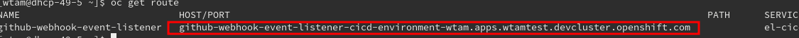


Goto your demo `taxi` Github repository.

```
https://github.com/$GITHUB_USER/taxi
```

Goto Settings to create a Webhook as follow

 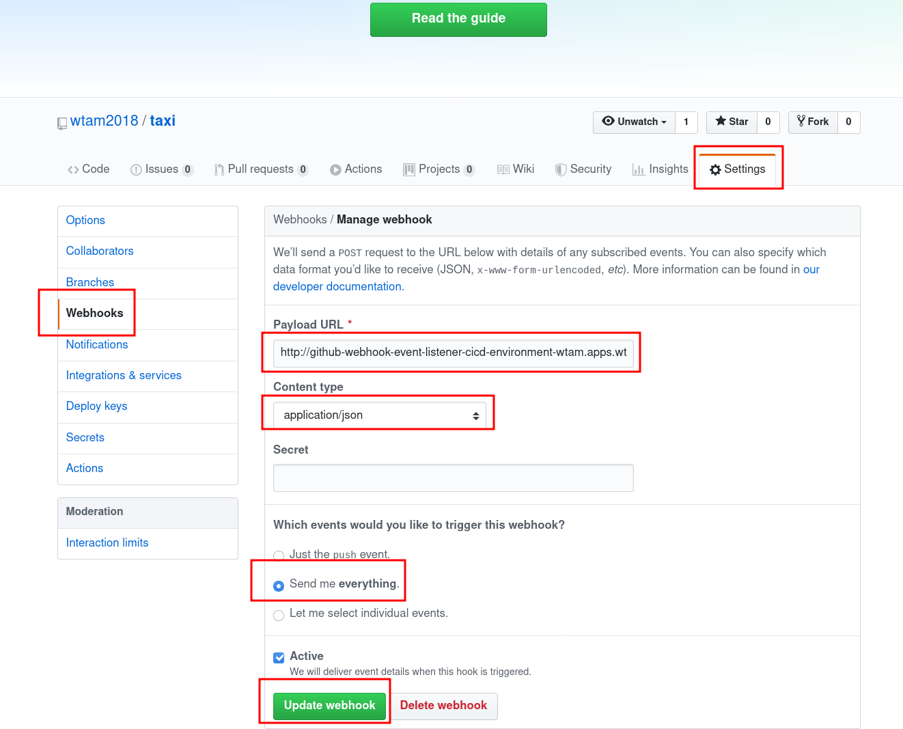


# Test it

## Generate a Webhook Event

* Submit a Pull Request to your `taxi` GitHub repository
* Merge the Pull Request which should trigger a Pipeline Run in the CI Pipeline

## Re-generate Webhook Event without Pull Request

* Go back to the WebHooks Setting in your `taxi` GitHub repository and look for the last `Push` event.  You can re-deliver the event for testing without creating a Pull Request.

 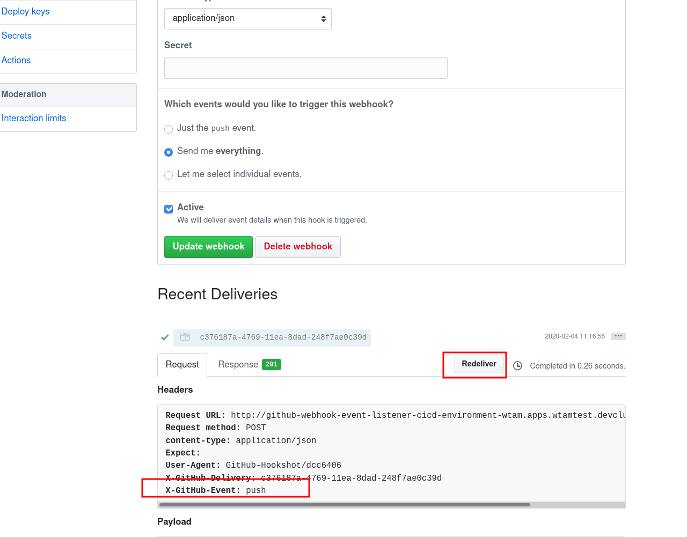

## Use Tekton Dashboard to check Pipeline Runs

* Lookup the hostname of Tekton Dashboard

```shell
oc get route -n tekton-pipelines
```
 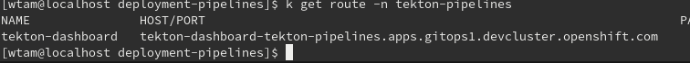

In this case, we put https://tekton-dashboard-tekton-pipelines.apps.gitops1.devcluster.openshift.com in the browser.  

* Pick the namespace according to the event generated.   E.g. `cicd-envrionment` if PR has been merged to the `taxi` master branch.

* Click `PipelineRuns`.  A list of PipelineRuns will be shown.  Click the new/executing PipelineRun


 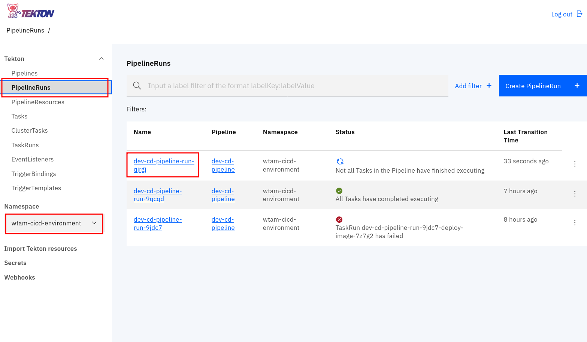

* The status and the logs are shown.

 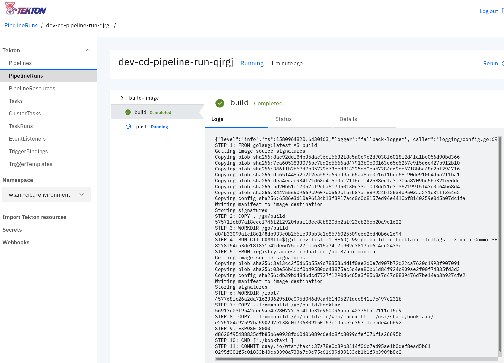
