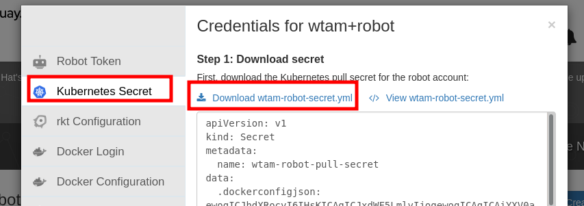

# A Step by Step Guide to Deployment Example

Automated Tekton deployments from GitHub

## Fork demo git repos

Fork the following repos to be used in your eample.
   * https://github.com/bigkevmcd/taxi
   * https://github.com/bigkevmcd/taxi-stage-config

 Download your gihub access token
 
 Go to https://github.com/settings/tokens and generate an access token.   Download and save to `github-token.txt`.

 
## Install Tekton Pipeline
 ```shell
oc apply -f https://github.com/tektoncd/pipeline/releases/download/v0.9.1/release.yaml
 ```

## Install Tekton Triggers
 ```shell
oc apply -f https://github.com/tektoncd/triggers/releases/download/v0.1.0/release.yaml
 ```

## Install Tekton Dashboard (optional)

 ```shell
oc apply --filename https://github.com/tektoncd/dashboard/releases/download/v0.3.0/dashboard-latest-openshift-tekton-dashboard-release.yaml --validate=false

oc apply --filename https://github.com/tektoncd/dashboard/releases/download/v0.3.0/openshift-tekton-webhooks-extension-release.yaml --validate=false
 ```

## Create Projects/Namespaces

```shell
oc new-project dev-environment
oc new-project stage-environment
oc new-project cicd-environment
```

**_NOTE:_**  Continue this setup in `cicd-envnironment` project.


## Quay Credentials to push built image to Quay.io registry

 * Login to your Quay.io account that you can generate read/write credentials for.  In user's name pulldown menu, goto Account Settings -> Robot Account (button on the left).   Create a robot account for yourself.  Click your robot account link.

 
 * Download Kubernates Pull Secret (\<user\>-robot-secret.yml)

 

 * Download Docker config (\<user\>-robot-auth.json)
 

 * Create Kubernates secret from downloaded pull secret yaml

 **_NOTE:_**  Replace \<path\to\> with path to yaml file and  \<user\> with your user ID. 
```shell
oc apply -f <path/to>/<user>-robot-secret.yml
  ```
 * Create secret from Docker Configuration

  **_NOTE:_**  Replace \<path\to\> with path to yaml file and  \<user\> with your user ID. 

 ```shell
 oc create secret generic regcred --from-file=.dockerconfigjson="<path/to>/<user>-robot-auth.json" --type=kubernetes.io/dockerconfigjson
 ```
 You can check the created secrets. 
 
 ```shell
 oc get secret
 ```

 ## Setup Service Account

* Create Service Account (**replace \<user\> with your userid**)

```shell
cat <<EOF | oc apply -f -
apiVersion: v1
kind: ServiceAccount
metadata:
  name: demo-sa
  namespace: cicd-environment
secrets:
- name: <user>-robot-pull-secret
EOF
```
* Create Role

 ```shell
cat <<EOF | oc apply -f -
kind: Role
apiVersion: rbac.authorization.k8s.io/v1
metadata:
  name: tekton-triggers-openshift-demo
rules:
- apiGroups: ["tekton.dev"]
   resources: ["eventlisteners", "triggerbindings", "triggertemplates", "tasks", "taskruns"]
   verbs: ["get"]
- apiGroups: ["tekton.dev"]
   resources: ["pipelineruns", "pipelineresources", "taskruns"]
   verbs: ["create"]
EOF
```
 * Create Role Binding

 ```shell
 cat <<EOF | oc apply -f -
 apiVersion: rbac.authorization.k8s.io/v1
kind: RoleBinding
metadata:
   name: tekton-triggers-openshift-binding
subjects:
- kind: ServiceAccount
   name: demo-sa
roleRef:
   apiGroup: rbac.authorization.k8s.io
   kind: Role
   name: tekton-triggers-openshift-demo
 EOF
 ```
 * Configure Service Account admin policy 
 ```shell
oc adm policy add-scc-to-user privileged -z demo-sa
oc adm policy add-role-to-user edit -z demo-sa
```
* Create Role Bindings for Service Accounts in `dev` and `stage` projects
```shell
oc create rolebinding demo-sa-admin-dev --clusterrole=admin --serviceaccount=cicd-environment:demo-sa --namespace=dev-environment
oc create rolebinding demo-sa-admin-stage --clusterrole=admin --serviceaccount=cicd-environment:demo-sa --namespace=stage-environment
```
## Create Tasks

Create buildah task yaml file with the following content.  Apply yaml file.   `oc appyl -f <yaml file>`

```shell
apiVersion: tekton.dev/v1alpha1
kind: Task
metadata:
  name: buildah-task
spec:
  inputs:
    params:
    - name: BUILDER_IMAGE
      description: The location of the buildah builder image.
      default: quay.io/buildah/stable:v1.11.3
      type: string
    - name: DOCKERFILE
      description: Path to the Dockerfile to build.
      default: ./Dockerfile
      type: string
    - name: TLSVERIFY
      description: Verify the TLS on the registry endpoint (for push/pull to a non-TLS registry)
      default: "true"
      type: string
    resources:
    - name: source
      type: git
  outputs:
    resources:
    - name: image
      type: image
  steps:
  - name: build
    image: $(inputs.params.BUILDER_IMAGE)
    workingDir: /workspace/source
    command: ['buildah', 'bud', '--tls-verify=$(inputs.params.TLSVERIFY)', '--layers', '-f', '$(inputs.params.DOCKERFILE)', '-t', '$(outputs.resources.image.url)', '.']
    volumeMounts:
    - name: varlibcontainers
      mountPath: /var/lib/containers
    securityContext:
      privileged: true
  - name: push
    image: $(inputs.params.BUILDER_IMAGE)
    workingDir: /workspace/source
    command: ['buildah', 'push', '--tls-verify=$(inputs.params.TLSVERIFY)', '$(outputs.resources.image.url)', 'docker://$(outputs.resources.image.url)']
    volumeMounts:
    - name: varlibcontainers
      mountPath: /var/lib/containers
    securityContext:
      privileged: true
  volumes:
  - name: varlibcontainers
    emptyDir: {}
```

Create github status task

Create github status task yaml file with the following content.  Apply yaml file.   `oc appyl -f <yaml file>`

```shell
apiVersion: tekton.dev/v1alpha1
kind: Task
metadata:
  name: create-github-status-task
spec:
  inputs:
    params:
    - name: REPO
      description: The repo to publish the status update for e.g. tektoncd/triggers
      type: string
    - name: COMMIT_SHA
      description: The specific commit to report a status for.
      type: string
    - name: STATE
      description: The state to report error, failure, pending, or success.
      type: string
    - name: TARGET_URL
      type: string
      default: ""
      description: The target URL to associate with this status.
    - name: DESCRIPTION
      type: string
      description: A short description of the status.
    - name: CONTEXT
      type: string
      description: A string label to differentiate this status from the status of other systems.
  steps:
  - name: start-status
    image: quay.io/kmcdermo/github-tool:latest
    workingDir: /workspace/source
    env:
    - name: GITHUB_TOKEN
      valueFrom:
        secretKeyRef:
          name: github-auth
          key: token
    command: ["github-tool"]
    args:
      - "create-status"
      - "--repo"
      - "$(inputs.params.REPO)"
      - "--sha"
      - "$(inputs.params.COMMIT_SHA)"
      - "--state"
      - "$(inputs.params.STATE)"
      - "--target-url"
      - "$(inputs.params.TARGET_URL)"
      - "--description"
      - "$(inputs.params.DESCRIPTION)"
      - "--context"
      - "$(inputs.params.CONTEXT)"
```      

Create `deploy-from-source-task`

Create task yaml file with the following content.  Apply yaml file.   `oc appyl -f <yaml file>`

```shell
apiVersion: tekton.dev/v1alpha1
kind: Task
metadata:
  name: deploy-from-source-task
spec:
  inputs:
    resources:
      - name: source
        type: git
    params:
      - name: PATHTODEPLOYMENT
        type: string
        description: Path to the manifest to apply
        default: deploy
      - name: NAMESPACE
        type: string
        description: Namespace to deploy into
      - name: DRYRUN
        type: string
        description: If true run a server-side dryrun.
        default: "false"
  steps:
    - name: run-kubectl
      image: quay.io/kmcdermo/k8s-kubectl:latest
      workingDir: /workspace/source
      command: ["kubectl"]
      args:
        - "apply"
        - "--dry-run=$(inputs.params.DRYRUN)"
        - "-n"
        - "$(inputs.params.NAMESPACE)"
        - "-k"
        - "$(inputs.params.PATHTODEPLOYMENT)"
```

Create deploy-using-kubectl-task

Create task yaml file with the following content.  Apply yaml file.   `oc appyl -f <yaml file>`

```shell
apiVersion: tekton.dev/v1alpha1
kind: Task
metadata:
  name: deploy-using-kubectl-task
spec:
  inputs:
    resources:
      - name: source
        type: git
      - name: image
        type: image
    params:
      - name: PATHTODEPLOYMENT
        type: string
        description: Path to the manifest to apply
        default: deploy
      - name: NAMESPACE
        type: string
        description: Namespace to deploy into
      - name: DRYRUN
        type: string
        description: If true run a server-side dryrun.
        default: "false"
      - name: YAMLPATHTOIMAGE
        type: string
        description:
          The path to the image to replace in the yaml manifest (arg to yq)
  steps:
    - name: replace-image
      image: mikefarah/yq
      workingDir: /workspace/source
      command: ["yq"]
      args:
        - "w"
        - "-i"
        - "$(inputs.params.PATHTODEPLOYMENT)/deployment.yaml"
        - "$(inputs.params.YAMLPATHTOIMAGE)"
        - "$(inputs.resources.image.url)"
    - name: run-kubectl
      image: quay.io/kmcdermo/k8s-kubectl:latest
      workingDir: /workspace/source
      command: ["kubectl"]
      args:
        - "apply"
        - "-n"
        - "$(inputs.params.NAMESPACE)"
        - "-k"
        - "$(inputs.params.PATHTODEPLOYMENT)"
```

Create template and bindings

Create `dev-cd-deploy-from-master-binding`

Create yaml file with the following content.  Apply yaml file.   `oc appyl -f <yaml file>`


```shell
apiVersion: tekton.dev/v1alpha1
kind: TriggerBinding
metadata:
  name: dev-cd-deploy-from-master-binding
spec:
  params:
  - name: gitref
    value: $(body.intercepted.ref)
  - name: shortsha
    value: $(body.intercepted.short_sha)
  - name: gitrepositoryurl
    value: $(body.repository.clone_url)
```

Create dev-cd-deploy-from-master-template 

Create yaml file with the following content.  Apply yaml file.   `oc appyl -f <yaml file>`


```shell
apiVersion: tekton.dev/v1alpha1
kind: TriggerTemplate
metadata:
  name: dev-cd-deploy-from-master-template
spec:
  params:
  - name: gitref
    description: The git revision
    default: master
  - name: gitrepositoryurl
    description: The git repository url
  - name: shortsha
    description: A shortened version of the SHA for the commit to deploy
  resourcetemplates:
  - apiVersion: tekton.dev/v1alpha1
    kind: PipelineRun
    metadata:
      name: dev-cd-pipeline-run-$(uid)
    spec:
      serviceAccountName: demo-sa
      pipelineRef:
        name: dev-cd-pipeline
      resources:
        - name: source-repo
          resourceSpec:
            type: git
            params:
            - name: revision
              value: $(params.gitref)
            - name: url
              value: $(params.gitrepositoryurl)
        - name: runtime-image
          resourceSpec:
            type: image
            params:
              - name: url
                value: REPLACE_IMAGE:$(params.shortsha)
```
Create `dev-ci-build-from-pr-binding`

Create yaml file with the following content.  Apply yaml file.   `oc appyl -f <yaml file>`


```shell
apiVersion: tekton.dev/v1alpha1
kind: TriggerBinding
metadata:
  name: dev-ci-build-from-pr-binding
spec:
  params:
  - name: gitref
    value: $(body.pull_request.head.ref)
  - name: gitsha
    value: $(body.pull_request.head.sha)
  - name: gitrepositoryurl
    value: $(body.repository.clone_url)
  - name: fullname
    value: $(body.repository.full_name)
  - name: shortsha
    value: $(body.intercepted.short_sha)
```
Create `dev-ci-build-from-pr-template`

Create yaml file with the following content.  Apply yaml file.   `oc appyl -f <yaml file>`


```shell
apiVersion: tekton.dev/v1alpha1
kind: TriggerTemplate
metadata:
  name: dev-ci-build-from-pr-template
spec:
  params:
  - name: gitref
    description: The git branch for this PR
  - name: gitsha
    description: the specific commit SHA.
  - name: gitrepositoryurl
    description: The git repository url
  - name: shortsha
    description: A shortened version of the SHA for the commit to deploy
  - name: fullname
    description: The GitHub repository for this PullRequest.
  resourcetemplates:
  - apiVersion: tekton.dev/v1alpha1
    kind: PipelineRun
    metadata:
      name: dev-ci-pipeline-run-$(uid)
    spec:
      serviceAccountName: demo-sa
      pipelineRef:
        name: dev-ci-pipeline
      params:
      - name: REPO
        value: $(params.fullname)
      - name: COMMIT_SHA
        value: $(params.gitsha)
      resources:
        - name: source-repo
          resourceSpec:
            type: git
            params:
            - name: revision
              value: $(params.gitref)
            - name: url
              value: $(params.gitrepositoryurl)
        - name: runtime-image
          resourceSpec:
            type: image
            params:
              - name: url
                value: REPLACE_IMAGE:$(params.gitref)-$(params.shortsha)
```
Create `stage-cd-deploy-from-push-binding`
Create yaml file with the following content.  Apply yaml file.   `oc appyl -f <yaml file>`

```shell
apiVersion: tekton.dev/v1alpha1
kind: TriggerBinding
metadata:
  name: stage-cd-deploy-from-push-binding
spec:
  params:
  - name: gitref
    value: $(body.intercepted.ref)
  - name: gitsha
    value: $(body.commits.0.id)
  - name: gitrepositoryurl
    value: $(body.repository.clone_url)
```

Create `stage-cd-deploy-from-push-template`
```shell
apiVersion: tekton.dev/v1alpha1
kind: TriggerTemplate
metadata:
  name: stage-cd-deploy-from-push-template
spec:
  params:
  - name: gitref
    description: The git revision
    default: master
  - name: gitrepositoryurl
    description: The git repository url
  resourcetemplates:
  - apiVersion: tekton.dev/v1alpha1
    kind: PipelineRun
    metadata:
      name: stage-cd-pipeline-run-$(uid)
    spec:
      serviceAccountName: demo-sa
      pipelineRef:
        name: stage-cd-pipeline
      resources:
        - name: source-repo
          resourceSpec:
            type: git
            params:
            - name: revision
              value: $(params.gitref)
            - name: url
              value: $(params.gitrepositoryurl)
```

Create `stage-ci-dryrun-from-pr-binding`
```shell
apiVersion: tekton.dev/v1alpha1
kind: TriggerBinding
metadata:
  name: stage-ci-dryrun-from-pr-binding
spec:
  params:
  - name: gitref
    value: $(body.pull_request.head.ref)
  - name: gitrepositoryurl
    value: $(body.repository.clone_url)
```

```shell
apiVersion: tekton.dev/v1alpha1
kind: TriggerTemplate
metadata:
  name: stage-ci-dryrun-from-pr-template
spec:
  params:
  - name: gitref
    description: The git revision
    default: master
  - name: gitrepositoryurl
    description: The git repository url
  resourcetemplates:
  - apiVersion: tekton.dev/v1alpha1
    kind: PipelineRun
    metadata:
      name: stage-ci-pipeline-run-$(uid)
    spec:
      serviceAccountName: demo-sa
      pipelineRef:
        name: stage-ci-pipeline
      resources:
        - name: source-repo
          resourceSpec:
            type: git
            params:
            - name: revision
              value: $(params.gitref)
            - name: url
              value: $(params.gitrepositoryurl)

```
Create interceptor

```shell
cat <<EOF | oc apply -f -
apiVersion: apps/v1
kind: Deployment
metadata:
  name: demo-interceptor
  namespace: cicd-environment
spec:
  replicas: 1
  selector:
    matchLabels:
      app.kubernetes.io/name: demo-interceptor
  template:
    metadata:
     labels:
       app.kubernetes.io/name: demo-interceptor
    spec:
      serviceAccountName: demo-sa
      containers:
        - name: interceptor
          image: quay.io/kmcdermo/interceptor
          imagePullPolicy: Always
---
apiVersion: v1
kind: Service
metadata:
  name: demo-interceptor
  namespace: cicd-environment
spec:
  type: ClusterIP
  selector:
    app.kubernetes.io/name: demo-interceptor
  ports:
    - protocol: TCP
      port: 80
      targetPort: 8080
EOF
```
Create ci pipelines

Create `dev-ci-pipeline`
Create yaml file with the following content.  Apply yaml file.   `oc appyl -f <yaml file>`

```shell
apiVersion: tekton.dev/v1alpha1
kind: Pipeline
metadata:
  name: dev-ci-pipeline
spec:
  resources:
    - name: source-repo
      type: git
    - name: runtime-image
      type: image
  params:
    - name: REPO
      type: string
    - name: COMMIT_SHA
      type: string
  tasks:
    - name: create-pending-status
      taskRef:
        name: create-github-status-task
      params:
      - name: REPO
        value: $(params.REPO)
      - name: COMMIT_SHA
        value: $(params.COMMIT_SHA)
      - name: STATE
        value: "pending"
      - name: DESCRIPTION
        value: "Starting dev-ci-pipeline"
      - name: CONTEXT
        value: "dev-ci-pipeline"
    - name: build-image
      taskRef:
        name: buildah-task
      runAfter:
        - create-pending-status
      resources:
        inputs:
          - name: source
            resource: source-repo
        outputs:
          - name: image
            resource: runtime-image
    - name: create-success-status
      taskRef:
        name: create-github-status-task
      runAfter:
        - build-image
      params:
      - name: REPO
        value: $(params.REPO)
      - name: COMMIT_SHA
        value: $(params.COMMIT_SHA)
      - name: STATE
        value: "success"
      - name: DESCRIPTION
        value: "Completed dev-ci-pipeline"
      - name: CONTEXT
        value: "dev-ci-pipeline"
```

Create stage CI Pipeline

```shell
cat <<EOF | oc apply -f -
apiVersion: tekton.dev/v1alpha1
kind: Pipeline
metadata:
  name: stage-ci-pipeline
spec:
  resources:
    - name: source-repo
      type: git
  tasks:
    - name: apply-source
      taskRef:
        name: deploy-from-source-task
      resources:
        inputs:
          - name: source
            resource: source-repo
      params:
      - name: NAMESPACE
        value: stage-environment
      - name: DRYRUN
        value: "true"
EOF
```
Create `dev-cd-pipeline`

```shell
cat <<EOF | oc apply -f -
apiVersion: tekton.dev/v1alpha1
kind: Pipeline
metadata:
  name: dev-cd-pipeline
spec:
  resources:
    - name: source-repo
      type: git
    - name: runtime-image
      type: image
  tasks:
    - name: build-image
      taskRef:
        name: buildah-task
      resources:
        inputs:
          - name: source
            resource: source-repo
        outputs:
          - name: image
            resource: runtime-image
    - name: deploy-image
      runAfter:
        - build-image
      taskRef:
        name: deploy-using-kubectl-task
      resources:
        inputs:
          - name: source
            resource: source-repo
          - name: image
            resource: runtime-image
      params:
      - name: PATHTODEPLOYMENT
        value: DEPLOYMENT_PATH
      - name: YAMLPATHTOIMAGE
        value: "spec.template.spec.containers[0].image"
      - name: NAMESPACE
        value: dev-environment
EOF
```

Create `stage-cd-pipeline`

```shel
cat <<EOF | oc apply -f -
apiVersion: tekton.dev/v1alpha1
kind: Pipeline
metadata:
  name: stage-cd-pipeline
spec:
  resources:
    - name: source-repo
      type: git
  tasks:
    - name: apply-source
      taskRef:
        name: deploy-from-source-task
      resources:
        inputs:
          - name: source
            resource: source-repo
      params:
      - name: NAMESPACE
        value: stage-environment
EOF
```